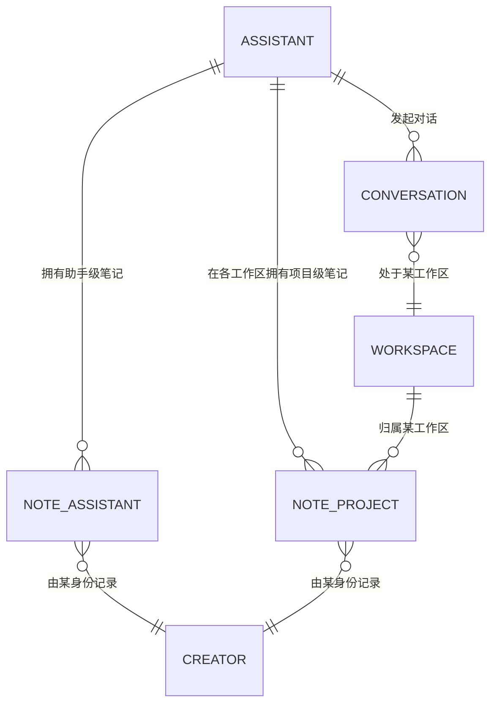

# 笔记本 · 助手记忆

> 给助手一个「笔记本」:助手在对话中自动记下值得长期保留的事实,开新对话时自动读回,让用户"换 CLI 不失忆、换对话不失忆"。
>
> 本篇为单功能 PRD,配套线框图见 [wireframe.html](./wireframe.html)。
> 助手、Agent、裸/内置/自定义助手等概念,见[助手总纲](../overview.md)。

---

## 一、要解决的问题

AionUi 是一个多 CLI 的桌面客户端——同一个助手底下可以换不同的命令行 AI 工具（Claude、Gemini、Qwen 等）来干活。但今天,这些工具各自记各自的记忆,彼此不通,导致用户遇到两种"失忆":

1. **换工具就失忆**。用户花了半天,让 Claude 终于搞懂"这个项目用 bun 不用 npm、回复要中文、代码风格要极简"。第二天想换 Gemini,Gemini 一无所知,得从头再交代一遍。同一个用户、同一个工作台,换个底层工具就变成陌生人。

2. **换对话就失忆**。哪怕一直用同一个工具,每开一个新对话都是一张白纸——它不记得上一个对话聊过什么。用户每周开五个对话,每个都要先说一遍"我是做建筑建模的、在搞那个参数化脚本项目、上次卡在 XX 问题"。

根因是:**记忆现在散落在各个 CLI 工具自己的文件里**（如 Claude 的 `CLAUDE.md`、Gemini 的 `.gemini/`），AionUi 没有一个统一的、跟着"助手"走的记忆。

> 名词约定:本文出现的「记忆」「笔记」指同一件事——助手沉淀下来、供以后对话使用的一条事实。功能整体叫**笔记本**,其中每一条叫**笔记**。

## 二、目标

- 给每个助手一个**笔记本**,沉淀该助手用得上的长期事实。
- 笔记本由助手**自动记录**,不需要用户手动整理。
- 开新对话时,相关笔记**自动读回**给助手,做到"换工具、换对话都记得"。
- 笔记本以**助手**为锚,因此天然跨底层 CLI 通用——同一个助手换了引擎,记忆照样在。

## 三、本期不做（Non-Goals）

| 不做的事                                                 | 原因 / 留待                                                   |
| -------------------------------------------------------- | ------------------------------------------------------------- |
| 用户手动写笔记、手动整理归类                             | 笔记本定位是"助手替你记、你偶尔审一眼"的后台沉淀,用户只看和删 |
| 让用户手动指定一条笔记记到哪一层                         | 由助手自动归类,避免认知负担（见 F-NOTE-03）                   |
| 与各 CLI 原生记忆文件（CLAUDE.md / GEMINI.md）的双向同步 | 关系尚未定,见末尾「待讨论模块」                               |
| 成本 / token 用量相关                                    | 与本功能无关                                                  |
| 团队（多助手协作）下的记忆共享                           | 先做单助手,团队场景后续评估                                   |

## 四、核心概念

### 笔记本挂在「助手」上

AionUi 里,**助手是独立于底层 CLI 的一层**:同一个助手,底下可以换 Claude、Gemini、Qwen，而助手本身（名称、规则、技能）不变。把笔记本挂在助手上,带来两个直接好处:

- 换底层 CLI,记忆还在（因为记忆属于助手,不属于某个 CLI）。
- 换对话,记忆还在（因为助手跨所有对话存在）。

### 笔记分两层

同一个助手记下来的事实,并非都该到处通用。用一个例子说明——假设有个「建模助手」,用它干两摊活:`办公楼项目`和`别墅项目`。它记住的事实有两类:

| 层级           | 记的是什么                          | 例子                                              | 作用范围                      |
| -------------- | ----------------------------------- | ------------------------------------------------- | ----------------------------- |
| **助手级笔记** | 关于"你这个人 / 这个助手"的稳定事实 | 回复用中文、代码风格极简、建模规范走 LOD 300      | 跟着助手走,**所有项目通用**   |
| **项目级笔记** | 关于"某一摊具体活"的事实            | 办公楼项目卡在某插件兼容问题、客户要求层高 3.6 米 | **锁在该项目**,不带到别的项目 |

> 为什么要分:如果不分层,"办公楼客户要求层高 3.6 米"这条会被带到别墅项目里,变成干扰。分层是为了让通用的通用、专属的专属。
>
> 类比:这和 Claude Code 的两层记忆同理——`~/.claude/CLAUDE.md`（全局,跟着你）+ 仓库里的 `./CLAUDE.md`（项目级,锁在该仓库）。区别是这里的"全局"锚点是**助手**,不是机器。

「项目」在 AionUi 里就是发起对话时选的那个**工作区目录**。所以项目级笔记的完整锚点是「该助手 × 该工作区」。

### 读 + 写,双向闭环

笔记本不是只记不用,它是双向的:

```
对话中  ──[助手自动记,只记稳定事实]──▶  笔记本（分助手级 / 项目级）
新对话  ◀──[自动读回对应层的笔记]─────  笔记本
用户    ──[随时看 / 删]──▶              笔记本
```

## 五、功能需求

> 功能编号:`F-NOTE-NN`,NOTE = 笔记本。编号仅作引用,不含优先级。

### F-NOTE-01 笔记本入口:助手详情页的一个分区

**现状**:助手详情页已有「身份 / 规则 / 工具 / 技能」等分区,但没有任何承载"记忆"的地方。助手配置里虽有一个 `context` 字段（手填的静态规则）,但它是用户写死的指令,不会自动累积,也不区分项目。

**需求**:在助手详情页新增一个「笔记本」分区（与身份/规则/工具/技能并列）,展示该助手沉淀的所有笔记。

- 笔记按**两层分组**展示:`助手级`（标注"所有项目通用"）与各个`项目级`分组（按工作区分组,标注项目名/路径）。
- 每条笔记展示:内容文本 + 记录时间 + 来源标识（哪个助手身份记的,见 F-NOTE-05）。
- 分区始终存在;没有任何笔记时显示空状态（见 F-NOTE-07）。

**验收**:

- [ ] 助手详情页有「笔记本」分区,与现有分区并列
- [ ] 笔记按"助手级 + 各项目级"分组展示,每组有清晰标题
- [ ] 每条笔记显示内容、时间、来源标识

---

### F-NOTE-02 两层记忆的存储

**需求**:笔记的存储区分两层,锚点不同:

| 层级   | 锚点          | 读回范围                     |
| ------ | ------------- | ---------------------------- |
| 助手级 | 助手          | 该助手的任意对话都读回       |
| 项目级 | 助手 × 工作区 | 仅该助手在该工作区的对话读回 |

一条笔记只属于其中一层,不重复。两层笔记的内部数据结构与存储方案交由技术决定。

**验收**:

- [ ] 笔记区分助手级与项目级两种存储,各自锚点正确
- [ ] 同一助手在不同工作区,各自的项目级笔记互不可见
- [ ] 助手级笔记在该助手的所有工作区对话中都可见

---

### F-NOTE-03 助手自动记录笔记

**需求**:对话过程中,助手在判断"出现了一个值得长期保留的事实"时,自动把它写入笔记本,并自动归到合适的层级（助手级 / 项目级）。

为避免笔记本变成噪音垃圾场,助手记录时遵循两条内部规矩（用户无感,不需配置）:

1. **只记"以后还用得上的稳定事实"**:用户偏好、规范、项目约束、关键决策等。
   - 记:"用户用 bun 不用 npm""项目决定采用方案 B"。
   - 不记:寒暄、一次性问答、临时的过程性内容。
2. **写前查重**:已记过的同一事实不再重复记录;若事实有更新,更新原条目而非新增。

归层判断同样由助手自动完成:关于用户/助手本身的稳定偏好归**助手级**;关于当前这摊活的事实归**项目级**。

> 写入时机为**实时**:一旦出现值得记的事实,当场就写。这样即使对话中途中断（助手挂掉、网络断开）,此前记下的内容也不会丢——这正是用户最看重的"换个会话还能想起来"。

**正常流程**:

1. 用户在对话中透露一个稳定事实（如"我们这个项目统一用 bun"）。
2. 助手识别这是值得长期保留的事实,且笔记本中尚无此条。
3. 助手将其写入笔记本,自动归到项目级。
4. 对话中出现一条轻量提示:"已记入笔记本"（见 F-NOTE-06）。

**异常情况**:

- 助手归错层（本该助手级却记成项目级,或反之）:用户当前只能删除该条;暂不提供"移动层级"操作（见待讨论模块）。
- 重复事实:被查重规则拦截,不产生第二条。

**验收**:

- [ ] 助手能在对话中自动写入笔记,无需用户手动触发
- [ ] 写入实时发生,不依赖对话结束
- [ ] 寒暄、一次性问答等不被记入（只记稳定事实）
- [ ] 同一事实不重复记录
- [ ] 新写入的笔记被自动归到助手级或项目级

---

### F-NOTE-04 新对话自动读回笔记

**需求**:用户用某助手在某工作区新建对话时,系统自动把该助手的**助手级笔记** + 该助手在**该工作区的项目级笔记**一并提供给助手,使其开场即"记得"这些事实。

- 读回在对话开始时自动完成,用户无需任何操作。
- 用户在对话中无需重复交代笔记里已有的背景。

**正常流程**:

1. 用户选「建模助手」+「办公楼项目」工作区,新建对话。
2. 系统读回:建模助手的全部助手级笔记 + 该助手在办公楼项目下的项目级笔记。
3. 助手开场即知道"回复用中文、走 LOD 300"（助手级）和"办公楼卡在某插件"（项目级）。

**异常情况**:

- 笔记数量很大,可能超出上下文容量:此时需要在读回时按相关性/时间做裁剪,具体策略交由技术评估（见待讨论模块）。

**验收**:

- [ ] 新对话开始时,自动读回对应的助手级 + 项目级笔记
- [ ] 切换底层 CLI（如从 Claude 换到 Gemini）后,同一助手新对话仍读回同一批笔记
- [ ] 项目级笔记只在对应工作区的对话中读回,不串到其他工作区

---

### F-NOTE-05 笔记的来源标识（creator）

**需求**:每条笔记记录其**来源身份**,用于让用户一眼看出"这条是谁记的"。

- 笔记本里同一个助手的笔记可能由不同底层 CLI 记下（这次用 Claude、下次用 Gemini）,来源标识体现实际记录时所用的身份。
- 来源仅用于展示与信任判断,不影响读回逻辑（读回只看层级与锚点）。

**验收**:

- [ ] 每条笔记带来源标识并在列表中展示
- [ ] 来源不同的笔记可被用户区分

---

### F-NOTE-06 记录笔记时的对话内可见性

**需求**:助手自动写入笔记时,在对话流中留下一条**轻量、可见但不打断**的提示（如一行"已记入笔记本:……"）,让用户知道助手刚记了什么。

- 目的是建立信任——用户能感知助手在动它的笔记本,而不是悄悄进行。
- 提示是轻量的,不要求用户确认,不阻断对话。

**验收**:

- [ ] 助手写入笔记时,对话流中出现一条对应的轻量提示
- [ ] 该提示不打断对话、不要求用户操作

---

### F-NOTE-07 用户操作:看与删

**需求**:用户对笔记本的操作仅限两种——**看**和**删**。

- **看**:在助手详情页的笔记本分区浏览所有笔记,按两层分组。
- **删**:删除任意一条笔记。删除后,该条不再参与之后的读回。
- 不提供手动新增、手动编辑内容、手动改层级（保持"自动记录"的定位）。

**异常情况**:

- 误删:本期不提供撤销/回收站;删除前给一次确认。

**验收**:

- [ ] 用户可浏览全部笔记,按助手级/项目级分组
- [ ] 用户可删除单条笔记,删除前有确认
- [ ] 删除后的笔记不再参与新对话的读回
- [ ] 界面不提供手动新增/编辑内容/改层级的入口

---

### F-NOTE-08 空状态

**需求**:笔记本尚无任何笔记时,分区显示空状态,用一句话说明这个分区会做什么:"助手会在对话中自动记录值得保留的事实,记下后会出现在这里。"

**验收**:

- [ ] 无笔记时显示空状态及说明文案
- [ ] 有笔记后空状态消失

---

## 六、实体关系



- 助手级笔记:锚点 = 助手。
- 项目级笔记:锚点 = 助手 × 工作区。
- 读回一次对话时,取「该助手的助手级笔记」∪「该助手在当前工作区的项目级笔记」。

---

## 七、待讨论模块

以下问题尚未定论,需技术调研或后续决策,先列出取舍,不在本期承诺:

1. **笔记本与各 CLI 原生记忆文件的关系**。
   各 CLI 有自己的记忆文件（`CLAUDE.md` / `GEMINI.md` 等）。笔记本是:
   - (路 A) 完全独立,自成一套,不碰原生文件——简单,但"跨 CLI 通用"只在 AionUi 应用内成立,用户去裸用 CLI 时读不到。
   - (路 B) 笔记本作为统一源,按需生成/写入各 CLI 的原生文件——真正跨 CLI 通用,但要处理写入冲突、格式差异,工程重。
     取舍待技术调研后定。

2. **读回时的上下文裁剪策略**。
   笔记很多时如何避免撑爆上下文（按时间?相关性?数量上限?）——交由技术评估,影响 F-NOTE-04。

3. **是否提供"移动层级"操作**。
   助手偶尔会归错层。当前定为"只能删",但若归错频繁,可考虑给一个轻量的"移到另一层"。先观察,暂不做。

4. **实时记录是否需要"暂存→稍后归档"降噪**。
   当前用"实时写入 + 两条内部规矩"控制噪音。若实际仍偏吵,可引入"先暂存、对话告一段落再择优归档"的二级机制。先用简单方案,观察后再说。
