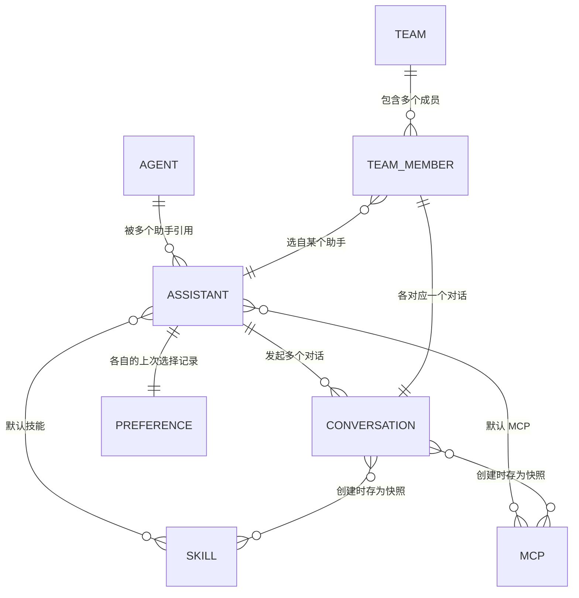

# 助手与 Agent 统一 · 总纲

> 这是一组共 4 份文档的总纲。本篇讲清整体——背景、目标、核心概念、方案全貌与分期路线；三份分期 PRD 各自聚焦一期、可独立交付研发。
>
> | 文档 | 解决的问题 |
> | --- | --- |
> | **总纲**（本篇） | 整体概念与路线，统一术语 |
> | [一期 · 助手治理](./phase-1-assistant-governance.md) | 把"助手"做厚：一套可承载默认配置的助手 |
> | [二期 · Agent 统一为助手](./phase-2-agent-unification.md) | 把 Agent 纳入助手体系，统一首页与团队的选择 |
> | [三期 · 官方资产热更](./phase-3-official-hot-update.md) | 官方助手与技能不发版即可更新 |

---

## 一、背景

AionUi 是一个多 Agent（多 CLI）的桌面客户端——它本身不做推理，而是调用各家命令行 AI 工具来完成对话。这些工具一部分是用户自行安装在电脑上的（Claude、Gemini、Qwen、Codex 等），另一部分是 AionUi 内置、随应用自带、无需安装的（如 AionCLI）。

围绕"用什么发起一次对话"，当前产品里并存着两套彼此独立的东西：

- **Agent**：在「设置 → Agent」页检测、管理的底层 CLI 工具。
- **助手（Assistant）**：在「设置 → 助手」页创建的预设，可带名称、头像、规则、技能，关联到某个 Agent。

这种并存带来三个现实问题：

1. **概念割裂**。首页同时摆着"直接选 Agent"和"选助手"两套入口，用户难以分清自己在选引擎还是选预设。Agent 在团队模式里又被当作"队友"，同一个词在不同位置指不同的东西。

2. **"检测到"不等于"能用"**。Agent 页只告诉用户"找到了哪些 CLI"，但找到不代表能连上——很多 Agent 要到真正发消息时才暴露"连接失败 / 未登录"等问题，用户措手不及。

3. **默认值项不齐全，且无处合理配置**。不论是助手还是 Agent，能预设的"默认值"都不完整——"默认用哪个模型、默认什么权限、默认带哪些技能和 MCP"这些项要么缺失、要么散落各处，用户也找不到一个合理的地方一次配好。结果是每开一个新对话都要重新选一遍。

## 二、目标

**把"能发起对话的东西"统一为一个概念——助手。** Agent 退居底层，作为助手引用的"引擎"；用户在首页、在团队里，面对的都只是"助手"。

围绕这个主线达成三件事：

- **一个更厚的助手**：助手能预设默认模型、默认权限、默认技能、默认 MCP、推荐提示词，开新对话即就绪。
- **一个可信的 Agent 体检台**：Agent 页不仅告诉用户"找到了什么"，还告诉"能不能用、怎么修"。
- **开箱即用**：装好一个 CLI，系统自动把它包装成一个可直接对话的助手，无需任何配置。

## 三、核心概念

统一后，面向用户只有两个核心概念。

| 概念 | 是什么 | 用户在哪接触 | 类比 |
| --- | --- | --- | --- |
| **Agent** | 用户电脑上安装的命令行 AI 工具（Claude、Gemini、AionCLI 等）。真正干活的推理引擎。**它本身不是助手**，是被助手引用的引擎。 | 设置 → Agent 页（纯运维体检） | 原材料 |
| **助手（Assistant）** | 引用一个 Agent，再叠加名称、头像、描述、规则、默认配置等，组成的一个可直接对话的对象。 | 首页（发起对话）、设置 → 助手页（管理） | 成品 |

一句话：**Agent 是原材料，助手是成品，用户面对的永远是成品。**

### 助手的三种来源

三种来源都是「助手」，彼此平级、共用同一套配置结构，只在"谁拥有、能改什么"上不同：

| 来源 | 怎么来的 | 谁拥有 | 能改什么 |
| --- | --- | --- | --- |
| **裸助手** | 系统为每个可用 Agent 自动生成，开箱即用 | 用户 | 全部字段 |
| **内置助手** | 官方预置、随版本维护的模板（如 Cowork） | 官方 | 仅 Agent 与默认模型/权限，其余只读 |
| **自定义助手** | 用户新建，或从其他助手复制派生 | 用户 | 全部字段 |

> Agent 不在此列——它是被这三种助手引用的引擎。

### 助手字段的两种生效方式

助手的字段按"改动何时生效"分两类，这个区分贯穿全套方案：

| 类别 | 字段 | 改动后的行为 |
| --- | --- | --- |
| **立即生效** | 名称、头像、描述、推荐提示词 | 一改就刷新所有引用处，连历史对话显示的名字/头像也跟着变（助手内部 ID 不变，显示层实时取最新值）。 |
| **仅对新会话生效** | 规则、默认模型、默认权限、默认技能、默认 MCP | 只影响之后新建的对话；进行中与历史对话保持其创建时的快照不变。 |

> 例：把「写作助手」改名，所有历史对话标题立刻显示新名；但改它的规则，只有之后新开的对话用新规则，聊到一半的对话不受影响。

### 默认配置的两种状态

助手的默认模型 / 权限 / 技能 / MCP，每一项可独立处在两种状态之一：

| 状态 | 新建对话时取什么值 | 对话中临时改动后 |
| --- | --- | --- |
| **暂不设置（自动记住上次）** | 用这个助手上次用过的值 | 记下这次的改动，作为该助手下次默认 |
| **已设定固定值** | 直接用设定的固定值 | 仅本次对话临时生效，不记录 |

"记住上次"按每个助手分别记，互不影响——哪怕两个助手用同一个 Agent。

## 四、方案全貌

| 模块 | 统一后是什么样 |
| --- | --- |
| **Agent 页** | 纯运维体检台：检测有哪些 Agent、能否连接、测试连接，不发起对话、不配规则技能。 |
| **助手** | 厚配置：身份 + 引擎 + 默认模型/权限/技能/MCP + 规则 + 推荐提示词；裸/内置/自定义三种来源统一结构。 |
| **首页** | 只摆助手：一排横向助手 pill，点中即用，无二级页；不再有"直接选 Agent"的入口。 |
| **团队** | 选队友 = 从同一批助手里挑（裸/内置/自定义都行），不再面对"光秃秃的引擎"列表。 |

## 五、分期路线

划分主线：**先把"助手"做厚（一期，纯配置层），再把 Agent 纳进来统一（二期），最后解决官方资产更新方式（三期）。** 前一期是后一期的地基，按序落地。

| 期 | 名称 | 一句话 | 用户能感知到的变化 |
| --- | --- | --- | --- |
| **一期** | 助手治理 | 让助手能预设默认模型/权限/技能/MCP/推荐提示词 | 在助手编辑页里能配更多东西；新建对话时这些默认值自动带上；助手能"记住你上次的选择" |
| **二期** | Agent 统一为助手 | Agent 体检 + 自动生成裸助手 + 首页只摆助手 | 装好 CLI 即有一个开箱助手；首页变成单一助手选择 |
| **三期** | 官方资产热更 | 官方助手与技能不发版即可更新 | 官方优化的助手/技能能随时收到，不必等应用升级 |

各期详见对应分期 PRD。每份 PRD 自带该期的 Goals / Non-Goals、功能需求、验收标准与衔接说明。

## 六、实体关系（数据全貌）

下图说明各对象如何组成、如何关联。字段类型用通俗标注（id 标识 / 文本 / 列表 / 枚举 / 引用），非数据库定义。

- **AGENT**（即 CLI 工具）不是助手，是被助手引用的引擎。裸/内置/自定义助手都是 **ASSISTANT**，平级、共用结构，靠来源字段区分；系统为每个可用 AGENT 自动生成一个"裸"助手。
- **ASSISTANT → CONVERSATION**：助手是发起对话的模板。对话创建时把助手当时的配置存为快照，之后改助手只影响新对话。
- **ASSISTANT → PREFERENCE**：每个助手各有一份"上次选择"记录（"自动记住上次"用），互不共享。
- **TEAM → TEAM_MEMBER → ASSISTANT**：团队成员选自与首页同一批助手，继承其配置；底层复用同一套 Agent 与会话机制。

## 七、术语表

| 术语 | 含义 |
| --- | --- |
| **Agent** | 电脑上的命令行 AI 工具，被助手引用的引擎，本身不是助手。设置页里叫「Agent 管理」。 |
| **CLI** | 命令行工具（Command-Line Interface）。这里特指各家的 AI 命令行程序。 |
| **助手 / Assistant** | 引用一个 Agent 加配置后、可直接对话的对象。 |
| **裸助手** | 系统为每个可用 Agent 自动生成、未经配置的助手；名称头像取自该 Agent，其余留空。它是一种助手，与自定义助手平级。 |
| **内置助手** | 官方预置、随版本维护的助手模板（如 Cowork）。 |
| **自定义助手** | 用户新建或从别的助手复制派生出的助手。 |
| **技能 / Skill** | 可挂到助手上的一项能力（文件操作、网页浏览等）。一个助手可启用多项。 |
| **MCP** | 让助手接入外部服务/工具的标准接口（Model Context Protocol）。 |
| **会话 / 对话 / Conversation** | 用某个助手发起的一次对话。创建时固化一份配置快照。 |
| **pill** | 首页顶部那排横向的助手按钮，点击即选中对应助手。 |
