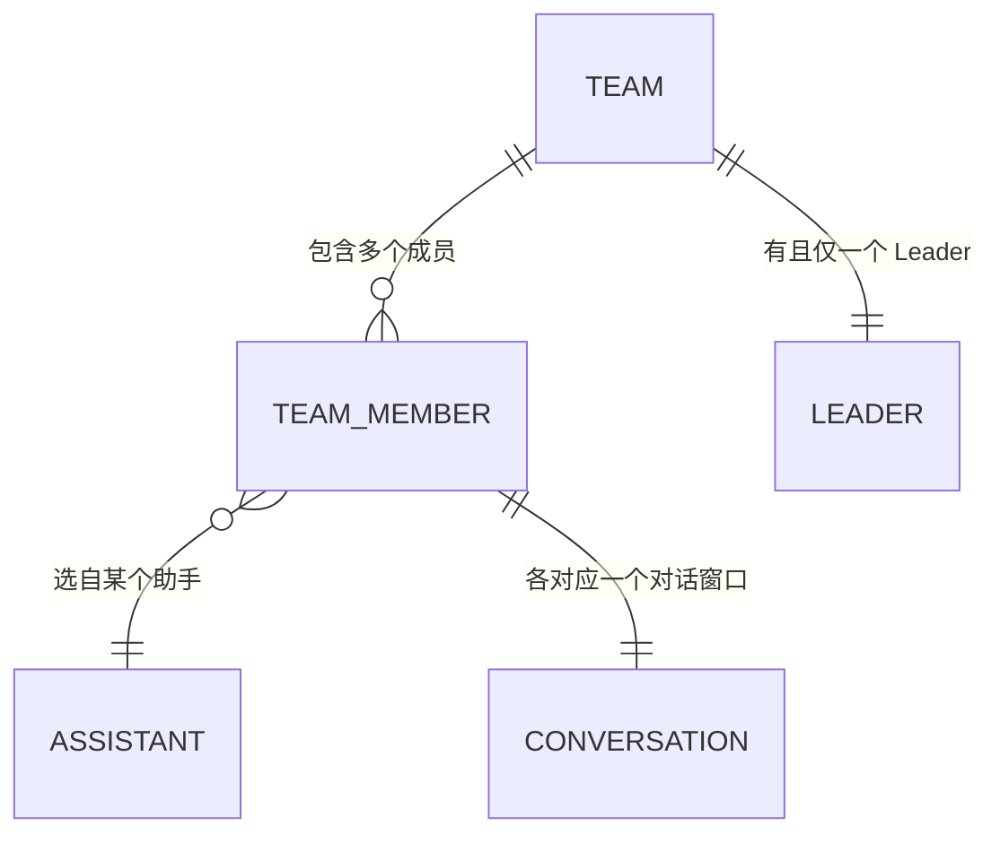

# 团队组建 · 多助手成员

> 让用户在**创建团队时一次选多个助手作为成员并指定一个 Leader**，并在**群聊过程中通过一个加号快速补充更多成员**。本期不改动团队群聊界面（保持现有的多对话窗口形态）。
>
> 本篇为单功能 PRD，配套线框图见 [wireframe.html](./wireframe.html)。
> 助手、Agent、Leader、临时队员等概念，见[助手总纲](../../assistants/overview.md)。

---

## 一、要解决的问题

AionUi 已经有团队（Team）能力：一个团队是「一组助手 + 一种协作方式」的容器，进入团队后每个成员是一个独立的对话窗口，并排展示（多窗口 + Tab）。

但今天**组建团队的方式很受限**：

- 创建团队时，用户**只能选一个助手作为 Leader**，初始团队就一个人。想要其他成员，只能靠 Leader 在对话中「动态生成临时队员」。用户没法在一开始就按自己的想法把几个助手拉到一起。
- 群聊开始后，**界面上没有"加人"的入口**。底层虽有添加成员的能力，但用户点不到——想中途补一个助手进来，做不到。

结果是：用户脑子里想的是"我要 A、B、C 三个助手组个队，A 当头"，但产品只让他选出 A，剩下的 B、C 要么没有、要么得绕路让 Leader 去生成。**组建团队的控制权不在用户手里。**

> 名词约定：
>
> - **团队（Team）**：一组助手成员 + 协作方式的容器。进入后是多成员并排的群聊。
> - **成员**：团队里的一个助手实例。每个成员是独立的一个位置（有自己的对话、状态），即使两个成员用的是同一个助手，也是两个独立的成员。
> - **Leader（队长）**：团队里负责协调、分派任务的那个成员。一个团队有且仅有一个 Leader。
> - **队友（teammate）**：Leader 以外的普通成员。

## 二、目标

- 创建团队时，用户能**一次选多个助手**作为成员，并**指定其中一个当 Leader**。
- 群聊过程中，用户能通过一个**加号**快速把更多助手补充为成员，交互轻量、一步到位。
- 不改动团队群聊界面——沿用现有的多对话窗口 + Tab 形态。

## 三、本期不做（Non-Goals）

| 不做的事 | 原因 / 现状 |
| --- | --- |
| 改动团队群聊界面（多窗口 / Tab 布局） | 本期明确保持现状，只加"补人"入口 |
| 移除成员 | 已有（群聊 Tab 上的移除能力保持不变） |
| Leader 在对话中动态生成临时队员 | 已有能力，本期不动 |
| 群聊中加成员时指定 / 改 Leader | 加进来的都是队友；Leader 的变更不在本期 |
| 单聊「邀请助手升级为团队」入口 | v3 有此设想，本期只做"创建"和"群聊补人"两个场景 |

## 四、核心概念

### 两个场景，两种交互重量

组建团队有两个时机，它们的交互"重量"不同，刻意做成两种形态：

| 场景 | 交互 | 为什么 |
| --- | --- | --- |
| **创建团队** | 一个成员管理弹窗：左侧可选助手、右侧已选成员、Leader 单选、团队名、工作空间 | 创建是"郑重配一个团队"，需要一次把人、队长、名字、工作空间都定好 |
| **群聊中补人** | Tab 栏尾部一个加号 → 下拉助手列表 → 点一个立刻拉进来 | 补人是"顺手加个帮手"，要清爽、一步到位，不该再弹一个大弹窗 |

### 成员可以重复：同一助手能被多次加入

一个团队里允许存在**多个用同一助手的成员**。因为每个成员是一个独立的位置（独立对话、独立状态），两个"同一助手"的成员就是两个并行、各干各的队员。所以：

- 创建弹窗和群聊加号的助手列表里，**已经在团队里的助手照常显示、可以再次选择 / 添加**。
- 每次添加都产生一个新的独立成员，不因"这个助手已在团队里"而被拦截。

### 谁能当 Leader

- 团队**有且仅有一个 Leader**，在创建时指定。
- 群聊中通过加号补进来的成员，**一律是队友**，不影响已有的 Leader。

## 五、功能需求

> 功能编号：`F-TEAM-NN`，TEAM = 团队组建。编号仅作引用，不含优先级。

### F-TEAM-01 创建团队：成员管理弹窗（多选 + 指定 Leader）

**现状**：创建团队的弹窗只让用户选**一个**助手作为 Leader，团队初始只有一个人。其余成员要靠 Leader 在对话中动态生成。

**需求**：把创建弹窗改为一个**成员管理弹窗**，支持一次选多个助手、并指定一个 Leader。

- **左侧**：可用助手列表（所有助手），带搜索；点击某个助手即把它加入右侧已选成员。
- **右侧**：已选成员列表，每人可 ✕ 移除；列表带 Leader 单选（一个团队仅一个 Leader）。
- **Leader 规则**：第一个被加入右侧的成员**自动成为 Leader**，用户可手动切换给其他成员。
- **底部**：团队名（必填）+ 工作空间（可选，文件夹选择器）+ 取消 / 确认。
- 助手列表中**已在右侧选中的助手仍可再次点击**，再次点击再加一个同一助手的成员（成员可重复，见核心概念）。
- 右侧为空时，确认按钮不可用；至少要有一个成员（即 Leader）。

**正常流程**：
1. 用户从团队入口点「＋ 新建团队」，打开成员管理弹窗。
2. 左侧点选若干助手 → 右侧出现对应成员，第一个自动为 Leader。
3. 用户按需把 Leader 切换给某个成员。
4. 填团队名（可选填工作空间）→ 确认 → 团队创建，进入群聊。

**异常情况**：
- 未选任何成员 / 未填团队名：确认按钮不可用，或给出必填提示。
- 只选了一个成员：允许（等于一个只有 Leader 的团队），与现状行为一致。

**验收**：
- [ ] 创建弹窗左侧可搜索、可多次点选助手加入右侧
- [ ] 右侧已选成员可移除、可单选一个 Leader
- [ ] 第一个加入的成员默认 Leader，可手动切换
- [ ] 同一助手可被多次加入，各自成为独立成员
- [ ] 团队名必填；确认后按所选成员创建团队并进入群聊

---

### F-TEAM-02 创建时按所选成员组建团队

**需求**：确认创建时，把右侧已选成员（含 Leader 标记）整体提交，一次性组建出含多个成员的团队。

- 提交的每个成员携带：关联的助手、在团队中的角色（leader / teammate）、模型等配置。
- 团队创建后，群聊中即出现所有已选成员的对话窗口（Leader 在最前）。

**正常流程**：
1. 用户在弹窗选定 N 个成员并确认。
2. 系统按这 N 个成员创建团队。
3. 进入群聊，N 个成员的窗口并排出现。

**异常情况**：
- 某个成员创建 / 初始化失败：其余成员正常，失败成员给出可感知的状态（具体表现交由技术处理）。

**验收**：
- [ ] 确认后团队按右侧全部成员创建，不再只创建 Leader 一人
- [ ] 群聊中出现全部所选成员的窗口，Leader 居前
- [ ] 各成员的助手、角色、模型等配置正确带入

> 技术确认项：团队创建接口需支持一次接收并初始化多个成员（现状数据结构 `assistants[]` 为数组、创建参数已含 `assistants` 列表；需确认后端能一次 spawn 多个而非仅取第一个）。

---

### F-TEAM-03 群聊中补人：Tab 栏加号 + 下拉选人

**现状**：进入团队后是多成员并排的群聊（多窗口 + Tab）。界面上**没有加成员的入口**；底层有添加成员的能力但未暴露。

**需求**：在群聊的成员 **Tab 栏尾部**放一个**加号**，点击后**直接下拉一个助手列表**，点选一个助手即**立刻**把它作为新队友拉进团队——不弹成员管理弹窗、不问 Leader、不填其他字段。

- 加号下拉列表**显示所有助手**（含已经在团队里的），可搜索。
- 点选一个助手 → 立即把它作为**队友（teammate）**加入团队，群聊随即出现它的窗口。
- **同一助手可反复添加**，每次添加都新增一个独立成员。
- 加进来的成员一律是队友，不改变已有 Leader。

**正常流程**：
1. 用户在群聊 Tab 栏尾部点加号。
2. 下拉出现助手列表（可搜索）。
3. 点选一个助手 → 该助手作为新队友立即加入，群聊出现其窗口。

**异常情况**：
- 添加的成员初始化失败：给出可感知状态，不影响其他成员（具体表现交由技术处理）。

**验收**：
- [ ] 群聊 Tab 栏尾部有加号入口
- [ ] 点击后直接下拉助手列表（可搜索），不复用创建弹窗
- [ ] 点选一个助手即刻加入为队友，群聊出现其窗口
- [ ] 下拉显示所有助手，同一助手可被反复添加为独立成员
- [ ] 新成员为队友，不改变已有 Leader

---

## 六、实体关系

- 一个团队含 N 个成员；每个成员是一个独立位置（独立对话），选自某个助手。
- 同一助手可对应多个成员（成员可重复）。
- 团队有且仅一个 Leader，创建时指定；群聊补入的成员均为队友。
- 现状衔接：团队数据结构 `TTeam.assistants[]` 已为成员数组，成员含 `role: leader | teammate`、`slot_id`、`conversation_id`、`assistant_id` 等；创建参数、添加成员端点均已存在——本功能主要是把已有能力暴露到界面。

---

## 七、待讨论模块

以下问题尚未定论，先列出取舍，不在本期承诺：

1. **团队成员数量是否设上限**。
   多选 + 可反复添加意味着成员数可能变多。是否给一个上限（性能 / 界面并排窗口的可用性）以及上限值，待技术与体验评估。

2. **加号下拉是否需要分组 / 常用排序**。
   助手多时，下拉是否按"最近使用 / 常用"排序或分组，本期先用简单的可搜索平铺列表，观察后再优化。

3. **创建时是否支持工作空间的 shared / isolated 选择**。
   数据层有 `workspace_mode`（shared / isolated）。本期创建弹窗是否向用户暴露该选择，还是先用默认值，待定。

4. **单聊升级为团队的入口**。
   v3 设想在单聊 Header 放加号邀请助手、升级为团队。本期不做，未来可复用创建弹窗（预填当前助手）实现。
