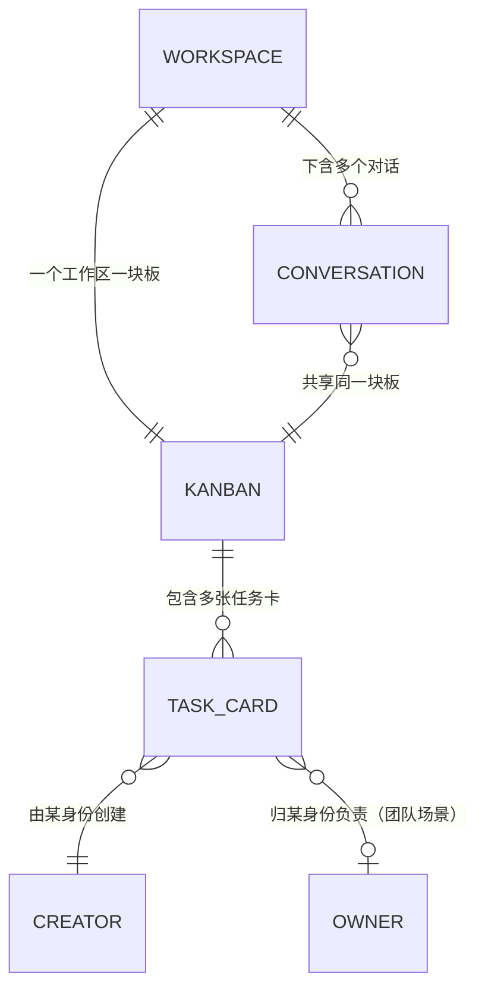

# 任务看板 · Kanban

> 给 AionUi 一块「工作区级的任务看板」:人和 AI 助手共同维护,用来跟踪"在同一个工作台里处理的多种活"的整体进度。
>
> 本篇为单功能 PRD,配套线框图见 [wireframe.html](./wireframe.html)。
> 助手、Agent、工作区等概念,见[助手总纲](../../assistants/overview.md)。

---

## 一、要解决的问题

AionUi 的用户（尤其是非典型开发用户——想做产品、又不爱用门槛高的 IDE，同时还要在一个地方处理多种活）有一个共同诉求:**在同一个工作台里跨多个对话做多种事，缺一个地方看到"我这摊事整体到哪了"。**

今天的现实是,进度被一条条对话切碎:

- 用户今天开一个对话让助手调研，明天开另一个对话让助手写脚本，后天又开一个处理文档——这几件事可能属于同一摊活,但**没有一个地方能看到它们合起来的全貌**。
- 助手在单次对话里执行任务时,虽然会展示一份临时的步骤清单（计划），但它跟着那条对话走、对话一关就散了,**不持久、不能跨对话回看、用户也管不了**。

结果是:用户脑子里有"一摊待办",但工作台里没有一个**持久、可见、人机都能维护**的地方承载它。

> 名词约定:本文「看板」指整块任务面板;板上每一张卡片代表一个待办事项,称为**任务卡**（也叫 issue）。卡片按状态排在不同的**列**里。

## 二、目标

- 给每个工作区一块**任务看板**,承载该工作区下所有对话产生的任务,形成进度全貌。
- 看板**人机共管**:用户能手动建/改/拖卡,AI 助手也能在对话中自动建/改卡。
- 助手操作看板通过一套**通用能力**实现,使得不论底层用哪个 CLI（Claude / Gemini / Qwen 等）都能维护同一块板。
- 看板是一个**可开关的模式**,用户主动开启后助手才会去维护它,不打扰只想简单问答的场景。

## 三、本期不做（Non-Goals）

| 不做的事 | 原因 / 留待 |
| --- | --- |
| 一个工作区内多块板 | 一个工作区一块板,助手无需纠结往哪写;多板后续再评估 |
| 任务卡的评论、附件、子任务 | 先做核心的卡片增改与状态流转 |
| 任务依赖关系在 UI 上的可视化（卡住谁/被谁卡住） | 数据层保留该信息,本期不向用户暴露 |
| 看板内容的跨工作区共享 / 汇总视图 | 先做单工作区 |
| 把单次对话的临时计划自动同步成看板任务 | 临时计划与看板是两套东西,本期不打通 |

## 四、核心概念

### 看板挂在「工作区」上,一个工作区一块板

「工作区」在 AionUi 里就是用户发起对话时归属的那一摊（对应一个项目目录）。看板挂在工作区这一层,意味着:

- 同一个工作区下的**任意对话**,看到的都是**同一块板**。
- 在对话 A 里建的任务,在对话 B 打开看板也能看到——这正是"进度全貌"的来源。

> 为什么是工作区级而不是会话级:用户在一个工作区里会开很多对话做同一摊活,如果每个对话各有一块板,进度就被切碎了,失去全局视角。一个工作区一块板,既给了全貌,也让助手无需纠结"这条任务该写到哪块板"。

### 看板是一套"助手能调用的能力"

助手维护看板,不是靠 AionUi 给每家 CLI 单独适配,而是通过一套**通用的任务能力**（建卡 / 改卡 / 移动卡等）。这套能力对所有底层 CLI 是统一的接口,因此:

- 不管这次对话底下用的是 Claude、Gemini 还是 Qwen,助手都用同一套动作操作同一块板。
- 具体以何种技术形态提供这套能力（如 MCP 服务等）,交由技术决定;产品层只要求"它是一套各 CLI 通用的任务能力"。

### 看板是一个可开关的「模式」（工作区级开关）

看板默认不打扰用户。它由一个**工作区级开关**控制:

| 状态 | 助手 | 看板 Tab |
| --- | --- | --- |
| **开启** | 拿到任务能力 ＋ 被提示"该拆任务时往板上写" | 正常使用 |
| **关闭** | 没有任务能力,不会去建任务 | Tab 仍在,显示引导,数据保留 |

开关是**工作区级**的:在某工作区开启后,该工作区下所有对话都进入看板模式;关闭只是收走助手的能力,**已有的板上数据不删**,用户随时可再开,数据还在。

### 人机共管 + 来源标识

看板上的卡片可能来自用户手动创建,也可能来自助手自动创建。每张卡记录**创建者（creator）**:

- creator 用于让用户一眼看出"这张是我建的，还是 AI 建的，甚至是哪个助手建的"——关系到用户对"板上多出来的卡"的信任。
- 另有 **owner（归谁干）** 字段,主要用于团队场景;单人工作区下 creator 与 owner 常是同一个。

## 五、功能需求

> 功能编号:`F-KANBAN-NN`,KANBAN = 任务看板。编号仅作引用,不含优先级。

### F-KANBAN-01 看板入口:对话页右侧面板的「任务」Tab

**现状**:对话页右侧面板已有「文件」「变更」两个 Tab。没有任何承载任务的地方。助手执行时的临时计划只出现在对话消息流里,关掉就没了。

**需求**:在对话页右侧面板新增第三个 Tab「任务」,与「文件」「变更」并列,点开即当前工作区的看板。

- Tab 顶部明确标注这块板是**当前工作区共享**的（如标题"AionUi · 任务"），让用户理解它不是这条对话私有。
- 同一工作区的任意对话打开这个 Tab,看到的是**同一块板**。
- Tab **始终常驻**;未开启看板模式时显示空状态 ＋ 开启引导（见 F-KANBAN-02、F-KANBAN-07）。

**验收**:
- [ ] 对话页右侧面板有「任务」Tab,与「文件」「变更」并列
- [ ] Tab 内标明该板为当前工作区共享
- [ ] 同一工作区不同对话打开「任务」Tab,看到同一块板

---

### F-KANBAN-02 看板模式开关（工作区级）

**需求**:看板由一个**工作区级开关**控制是否启用。

- **开启**:助手获得任务能力,并被提示在合适时机把任务写上板;「任务」Tab 进入可用状态。
- **关闭**:助手不再拥有任务能力、不会建任务;Tab 仍在,显示引导态;**板上已有数据不删除**。
- 开关作用于整个工作区:在该工作区开启后,其下所有对话都处于看板模式。
- 用户可随时开/关。关闭后再开启,之前的板和卡片原样还在。

**正常流程**:
1. 用户在某工作区的「任务」Tab 看到引导,点击「开启看板模式」。
2. 该工作区进入看板模式,助手获得任务能力。
3. 之后该工作区任意对话中,助手都可维护看板。

**异常情况**:
- 用户关闭模式后:Tab 变为引导态,但板与卡片数据保留,助手不再操作它。
- 重新开启:数据原样恢复可用。

**验收**:
- [ ] 看板由工作区级开关控制,开启后该工作区所有对话进入看板模式
- [ ] 关闭后助手不再拥有任务能力、不会建任务
- [ ] 关闭不删除已有的板与卡片;重新开启数据原样可用

---

### F-KANBAN-03 看板的列与任务卡

**需求**:看板按状态分**列**,卡片在列间流转。

- 列（状态）固定为四个:**Backlog（待规划）/ Todo（待办）/ In Progress（进行中）/ Done（已完成）**。
- 每张**任务卡**展示:任务编号（如 TASK-5）＋ 标题 ＋ 描述（可选）＋ 优先级（Low / Medium / High）＋ 创建者标识。
- 卡片字段定义:

| 字段 | 含义 | 取值 |
| --- | --- | --- |
| 标题 | 任务名 | 文本 |
| 描述 | 任务说明 | 文本（可选） |
| 状态 | 所在列 | Backlog / Todo / In Progress / Done |
| 优先级 | 紧急程度 | Low / Medium / High |
| 创建者 creator | 谁建的 | 用户 / 某助手 |
| 负责人 owner | 归谁干（团队场景） | 用户 / 某助手 |

> 依赖关系（卡住谁 / 被谁卡住）在数据层保留,本期不在 UI 暴露（见 Non-Goals）。

**验收**:
- [ ] 看板有 Backlog / Todo / In Progress / Done 四列
- [ ] 任务卡展示编号、标题、描述、优先级、创建者
- [ ] 卡片数据包含上述全部字段

---

### F-KANBAN-04 助手自动建/改任务卡

**需求**:看板模式开启时,助手可在对话中通过任务能力**创建、修改、移动**任务卡。

- 典型用法:用户和助手商定一份任务清单后,助手把这些任务建到 Backlog/Todo;随着推进,助手把卡从 Todo 移到 In Progress、再到 Done。
- 助手建/改卡通过通用任务能力完成,底层不论用哪个 CLI 都一致。
- 助手创建的卡,creator 标记为对应助手身份。

**正常流程**:
1. 用户:"帮我把这周要做的几件事拆成任务。"
2. 助手与用户确认清单后,逐条建卡到看板（Todo 列）。
3. 对话流中出现轻量提示:"已创建 3 个任务"（见 F-KANBAN-06）。
4. 推进中,助手把完成的卡移到 Done。

**异常情况**:
- 看板模式未开启:助手没有任务能力,不会建卡,可提示用户"开启看板模式后我可以帮你建任务"。
- 助手误建/建错:用户可手动改或删（见 F-KANBAN-05）。

**验收**:
- [ ] 看板模式开启时,助手能在对话中创建/修改/移动任务卡
- [ ] 助手创建的卡 creator 标记为对应助手
- [ ] 看板模式关闭时,助手不会建卡

---

### F-KANBAN-05 用户手动管理任务卡

**需求**:用户可在看板上直接管理卡片,与助手共管同一块板。

- **建**:手动新增任务卡（填标题、描述、优先级,选所在列）。
- **改**:编辑卡片内容、调整优先级。
- **移**:拖动卡片在列间流转（改变状态）。
- **删**:删除任务卡。
- 用户手动建的卡,creator 标记为"用户"。

**验收**:
- [ ] 用户可手动新增、编辑、拖动、删除任务卡
- [ ] 用户手动建的卡 creator 标记为用户
- [ ] 用户与助手对同一块板的改动都即时反映在看板上

---

### F-KANBAN-06 助手操作看板时的对话内可见性

**需求**:助手通过任务能力建/改/移卡时,在对话流中留下一条**轻量、可见但不打断**的提示（如"已创建任务 TASK-5：…"或"已将 TASK-3 移至 进行中"）。

- 目的是建立信任——用户能感知助手在动它的看板,而不是悄悄改。
- 提示轻量,不要求确认、不阻断对话。

**验收**:
- [ ] 助手建/改/移卡时,对话流出现对应的轻量提示
- [ ] 该提示不打断对话、不要求用户操作

---

### F-KANBAN-07 未开启模式的空状态

**需求**:工作区尚未开启看板模式时,「任务」Tab 显示空状态,说明这块板是干什么的,并提供开启入口。

- 文案说明:这是当前工作区共享的任务看板,开启后你和助手都能在这里管理任务进度。
- 提供「开启看板模式」按钮（对应 F-KANBAN-02）。

**验收**:
- [ ] 未开启模式时,「任务」Tab 显示空状态及说明
- [ ] 空状态提供「开启看板模式」入口
- [ ] 开启后进入正常看板视图

---

## 六、实体关系

- 看板锚点 = 工作区,一对一。
- 任务卡归属看板;同一工作区所有对话共享这块板。
- 现状衔接:AionUi 已有的团队任务表（带状态 / 负责人 / 依赖等字段）结构与任务卡高度一致,本功能可在其基础上泛化,让单人工作区也能用同一套任务结构,避免出现两套任务系统。

---

## 七、待讨论模块

以下问题尚未定论,先列出取舍,不在本期承诺:

1. **creator 与 owner 的展示**。
   单人工作区下两者常相同。UI 上是否都展示,还是默认只显示 creator、owner 留给团队场景?先观察单人场景需求。

2. **任务依赖关系何时暴露**。
   数据层保留"卡住谁 / 被谁卡住",但本期不在 UI 展示。何时、以何种形式（连线?标签?）暴露给用户,待团队/复杂项目场景明确后再定。

3. **任务能力的具体动作粒度**。
   建卡 / 改卡 / 移卡是核心。是否还需要批量操作、按条件查询、归档等,交由技术与后续迭代评估。

4. **临时计划与看板的关系**。
   助手单次对话的临时步骤清单与持久看板目前是两套东西。是否、以及如何让临时计划"升级"为看板任务,本期不做,留待观察用户是否有此预期。
