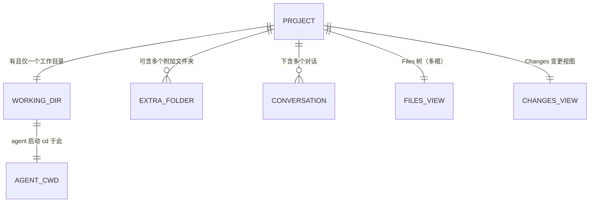

# Project · 多文件夹文件浏览器

> 把 AionUi 的「工作空间」从一个单一挂载目录，升级成一个能容纳多个文件夹的 **Project**：用户像在 IDE 里那样，把多个文件夹并列在左侧文件树中查看、预览、取用，让一次对话能跨多个文件夹工作。
>
> 本篇为单功能 PRD，配套线框图见 [wireframe.html](./wireframe.html)。
> 助手、Agent、会话等概念，见[助手总纲](../../assistants/overview.md)。

---

## 一、要解决的问题

AionUi 每发起一次对话，底层 AI 工具（agent）启动时**必须 cd 到一个目录**——这是技术上绕不开的一步。所以今天的设计是：用户发起会话时选一个目录作为「工作空间」，没选就由系统临时生成一个目录。一次对话，就挂在这**一个**目录上。

但用户的真实工作方式不是"一次只碰一个文件夹"：

- 用户想让 AI 一边参考 A 文件夹的资料、一边在 B 文件夹里干活；想把另一个项目的某个文件拉进来给 AI 看；想在一个地方同时浏览好几摊相关的文件。
- 今天做不到——一次对话只能看到一个目录的文件树，其他文件夹的东西进不来。

参考成熟编辑器（如 Zed）的做法：一个 project 可以**添加多个文件夹**，它们在左侧文件树里作为并列的根节点展示，全局搜索、引用都跨这些文件夹。AI 本就有读写任意路径的能力，只要把文件路径递给它，它就能跨文件夹工作。

> 名词约定：
>
> - **Project**：一次对话所归属的容器。它包含一个或多个文件夹，以及基于这些文件夹的 Files（文件浏览）、Changes（变更）等视图。**Project 取代过去"工作空间"这个单一目录的概念。**
> - **工作目录**：Project 里的第一个文件夹，也是 agent 启动时 cd 进去的那个目录。AI 默认在这里读写文件。
> - **附加文件夹**：用户额外添加进 Project 的其他文件夹，供 AI 查阅、取用，平级展示在文件树里。

## 二、目标

- 一个 Project 能容纳**多个文件夹**，在 Files 树里作为并列根节点展示。
- 明确区分**工作目录**（AI 干活的家）与**附加文件夹**（供查阅取用），让用户清楚 AI 默认在哪读写文件。
- 用户可随时往 Project 里**添加 / 移除**附加文件夹。
- 任意文件夹里的文件都能通过 **add to chat** 递给 AI（发绝对路径），实现一次对话跨多个文件夹工作。
- 文件夹集合**绑定到 Project 并持久化**，重开还在。

## 三、本期不做（Non-Goals）

| 不做的事                        | 原因 / 留待                                                                                  |
| ------------------------------- | -------------------------------------------------------------------------------------------- |
| 进行中切换 / 更改工作目录       | agent 启动即 cd，运行中改 cwd 等于重启；本期工作目录创建后锁死                               |
| 用软链接实现多文件夹            | 采用"记录多个绝对路径"的方式（参考 Zed），不在磁盘建链接、不污染用户目录；底层方式交由技术定 |
| 临时目录的清理策略              | 与本功能正交，单独评估                                                                       |
| 跨文件夹的全局内容搜索          | 现状仅文件名搜索；内容搜索本期不做                                                           |
| 附加文件夹的变更（Changes）追踪 | Changes 仍以工作目录为主，附加文件夹是否纳入变更视图见待讨论模块                             |

## 四、核心概念

### Project 是"多文件夹的容器"，不再是单一目录

过去：一次对话 = 一个挂载目录。
现在：一次对话归属一个 **Project**，Project 里可以有多个文件夹。面板顶层叫 **Project**，内含 Tab：

| Tab         | 内容                            |
| ----------- | ------------------------------- |
| **Files**   | 多文件夹的文件树（本 PRD 重点） |
| **Changes** | 文件变更视图（沿用现状）        |

### 工作目录 vs 附加文件夹

|          | 工作目录                                     | 附加文件夹                                      |
| -------- | -------------------------------------------- | ----------------------------------------------- |
| 是什么   | Project 的第一个文件夹，agent 启动 cd 的目录 | 用户额外加入、供 AI 查阅取用的文件夹            |
| AI 行为  | AI 默认在此读写文件、执行命令                | AI 通过绝对路径读写，但"家"不在这               |
| 在树里   | **固定置顶 + 标签**标明                      | 排在工作目录之下，平级展示                      |
| 可否移除 | **不可移除**（它是 agent 的家）              | 可随时移除（Remove from Project，不删磁盘文件） |
| 可否更改 | 创建 Project 时定下，**进行中锁死**          | 随时添加 / 移除                                 |

> 为什么工作目录要显性标出：AionUi 的用户很多不是专业开发者，不懂"当前工作目录(cwd)"的概念。如果不告诉他们"AI 默认在这个文件夹读写"，他们会困惑"我让 AI 建的文件跑哪去了"。明确标记反而让心智清楚：这个是主项目，那几个是顺便拉进来给 AI 看的。
>
> 技术约束说明：agent 在启动时 cd 进工作目录，运行中无法平滑更改 cwd（更改等于重启会话）。因此工作目录在 Project 创建时定下、进行中锁死；要换工作目录需新开 Project。附加文件夹不涉及 cd，可自由增减。

### 不用软链接，用"路径集合"

参考 Zed：多个文件夹各自是独立的根，系统记录的是一组**绝对路径**，用「(属于哪个文件夹 + 文件夹内相对路径)」来定位文件。**不在磁盘上建软链接**，因此不污染用户真实目录、不会让文件遍历或 git 跟着链接乱跑。底层具体实现方式交由技术决定。

## 五、功能需求

> 功能编号：`F-PROJ-NN`，PROJ = Project。编号仅作引用，不含优先级。

### F-PROJ-01 Project 面板与 Files 树（多文件夹根）

**现状**：对话页右侧面板展示单个工作空间的文件树——一个顶级根节点（如"AionUi"）＋ 其下文件。面板与现状的 Files / Changes Tab 已存在。

**需求**：Files 树支持展示**多个并列的根节点**，每个根对应 Project 里的一个文件夹。

- 每个根节点可独立展开 / 折叠，展示该文件夹内的目录与文件。
- 工作目录的根节点**固定排在最上面**，并带「工作目录」标签；附加文件夹的根节点排在其下，平级展示。
- 鼠标 hover 根节点时，显示该文件夹的**完整绝对路径**（多文件夹时文件夹名可能相近，靠路径区分）。
- 单文件夹的 Project（即只有工作目录、没有附加文件夹）展示形态与现状一致。

**验收**：

- [ ] Files 树能并列展示多个文件夹根节点，各自可展开 / 折叠
- [ ] 工作目录根节点固定置顶并带「工作目录」标签
- [ ] 附加文件夹根节点排在工作目录之下，平级展示
- [ ] hover 根节点显示完整绝对路径

---

### F-PROJ-02 添加文件夹（Add Folder to Project）

**需求**：用户可往当前 Project 添加附加文件夹。

- 入口：Files 树的**搜索框左侧一个加号**，hover 显示提示「Add Folder to Project」。
- 点击后弹出系统目录选择器，选定的目录作为一个**新的并列根**加入 Files 树（排在工作目录下方）。
- 添加的是文件夹的**路径引用**，不复制文件、不建软链接、不改动磁盘。

**正常流程**：

1. 用户点击搜索框左侧加号。
2. 选择一个目录。
3. 该目录作为附加文件夹出现在 Files 树（工作目录之下）。

**异常情况**：

- 重复添加同一目录：不重复添加，可提示"该文件夹已在 Project 中"。
- 添加的目录是工作目录的子目录 / 父目录：仍允许添加（由用户决定），不做特殊拦截（见待讨论模块）。

**验收**：

- [ ] 搜索框左侧有加号入口，hover 提示「Add Folder to Project」
- [ ] 点击可选择目录并作为附加文件夹加入 Files 树
- [ ] 添加为路径引用，不复制文件、不建软链接
- [ ] 重复添加同一目录不产生重复根节点

---

### F-PROJ-03 移除附加文件夹（Remove from Project）

**需求**：用户可把附加文件夹从 Project 移除。

- 操作：右键附加文件夹的根节点 → **Remove from Project**。
- 移除只是把该文件夹从 Files 树拿走，**不删除磁盘上的任何文件**。
- **工作目录不可移除**：工作目录的根节点右键菜单中不提供 Remove（它是 agent 的家）。

**验收**：

- [ ] 附加文件夹右键菜单有「Remove from Project」
- [ ] 移除后该文件夹从 Files 树消失，磁盘文件不受影响
- [ ] 工作目录不提供移除入口

---

### F-PROJ-04 工作目录的标识与锁定

**需求**：工作目录在 Project 中具有特殊地位，需明确标识、且进行中不可更改。

- 工作目录 = Project 创建时的第一个文件夹 = agent 启动 cd 的目录。
- 在 Files 树固定置顶 ＋ 带「工作目录」标签。
- 附带一句说明（如 hover 标签或信息图标）：「AI 默认在这里读写文件；其他文件夹是你额外加进来供 AI 查阅 / 取用的。」
- 工作目录在 Project 创建后**锁定**：进行中不能更改或移除；要更换需新开 Project。

**验收**：

- [ ] 工作目录带「工作目录」标签并置顶
- [ ] 提供一句对工作目录作用的说明
- [ ] 进行中工作目录不可更改、不可移除

---

### F-PROJ-05 跨文件夹 add to chat（发绝对路径）

**需求**：任意文件夹（工作目录或附加文件夹）里的文件，都能通过 add to chat 递给 AI。

- 操作沿用现状：右键文件 → add to chat（或双击）。
- 递给 AI 的统一是文件的**绝对路径**——不论文件在工作目录还是附加文件夹下，保证 AI 都能定位（附加文件夹的文件不在 cwd 下，相对路径会找不到）。
- 这使得一次对话能跨多个文件夹工作：AI 拿到绝对路径即可读写对应文件。

**正常流程**：

1. 用户在附加文件夹里右键某文件 → add to chat。
2. 该文件的绝对路径被递给 AI。
3. AI 可读取 / 处理该文件，尽管它不在工作目录下。

**验收**：

- [ ] 工作目录与附加文件夹的文件都可 add to chat
- [ ] add to chat 递给 AI 的是文件绝对路径
- [ ] 附加文件夹中的文件 add to chat 后，AI 能正确定位并处理

---

### F-PROJ-06 文件夹集合的持久化

**需求**：Project 包含哪些文件夹（工作目录 ＋ 附加文件夹）的信息，绑定在 Project 上并持久化。

- 关闭后重新打开该 Project / 对话，文件夹集合原样恢复（与 Zed 把 worktree 集合绑定到 workspace 并序列化一致）。
- 附加文件夹的增 / 删即时反映，并被持久化。

**异常情况**：

- 某附加文件夹的路径在磁盘上已不存在（被用户在系统里删了 / 移动了）：在树里标为不可用状态，提供移除入口（具体表现交由技术处理）。

**验收**：

- [ ] 文件夹集合绑定到 Project 并持久化，重开后原样恢复
- [ ] 附加文件夹的增删被持久化
- [ ] 路径失效的附加文件夹有可感知的提示并可移除

---

### F-PROJ-07 预览面板服务于文件浏览器

**现状**：预览面板已支持多类型文件预览（markdown / code / image / office / pdf / diff 等），由文件树单击触发。

**需求**：多文件夹下，预览面板服务于整个 Files 浏览器——

- 不论文件来自工作目录还是附加文件夹，单击预览的行为一致。
- 预览能力沿用现状，不因多文件夹而改变。

**验收**：

- [ ] 工作目录与附加文件夹的文件单击预览行为一致
- [ ] 预览类型覆盖与现状一致

---

## 六、实体关系

- Project 锚点：工作目录（第一个文件夹，agent cd 路径）。
- 文件夹集合 = 工作目录（1，锁定）＋ 附加文件夹（0~N，可增删）。
- 文件定位：(属于哪个文件夹 + 文件夹内相对路径)；对外（递给 AI）统一用绝对路径。
- 现状衔接：现有「工作空间」字段（`conversation.extra.workspace` 等）承载工作目录；附加文件夹是本功能新增的路径集合，绑定到 Project 持久化。

---

## 七、待讨论模块

以下问题尚未定论，先列出取舍，不在本期承诺：

1. **附加文件夹是否纳入 Changes（变更）视图**。
   现状 Changes 以工作目录为主（git 风格）。附加文件夹常是别的仓库 / 资料夹，是否、如何纳入变更追踪，待技术与场景明确后定。本期 Changes 维持以工作目录为主。

2. **嵌套文件夹的处理**。
   用户把工作目录的子目录 / 父目录也添加为附加文件夹时，Files 树会出现路径重叠。本期不做特殊拦截，但是否需要去重 / 提示，待观察。

3. **"工作空间"措辞的全局替换范围**。
   面板顶层改叫 Project、Tab 叫 Files。现有 UI 中其他"工作空间"字样（如左侧会话分组标题、显示名）是否一并改为 Project，涉及面较广，待统一梳理后定。

4. **Project 是否成为显式的一等公民对象**。
   本期把 project 升级为"多文件夹容器"，但用户仍是在发起对话时确定它。未来是否让用户能脱离对话、独立"创建 / 命名 / 管理一个 Project"（像管理助手那样），与看板、笔记本的"工作区级"归属一并规划，本期不做。
